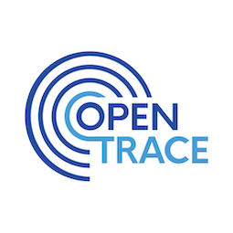

# TraceEkee Android app

TraceEkee is the community driven contact tracing program deployed in Maldives to combat the 
spread of covid-19. 

The implementation is derived from the [Open Trace repository](https://github.com/opentrace-community)
project.

**[main website](https://trace.hpa.gov.mv)**

---

## Setup and configuration

Please refer to the setup and configuration documentation on the
[Open Trace repository](https://github.com/opentrace-community/opentrace-android)

Slight changes were made to the structure of `app/build.gradle` for the sake of transparency in order to leave all build variables publicly visible except for credentials.

---

## Powered By

